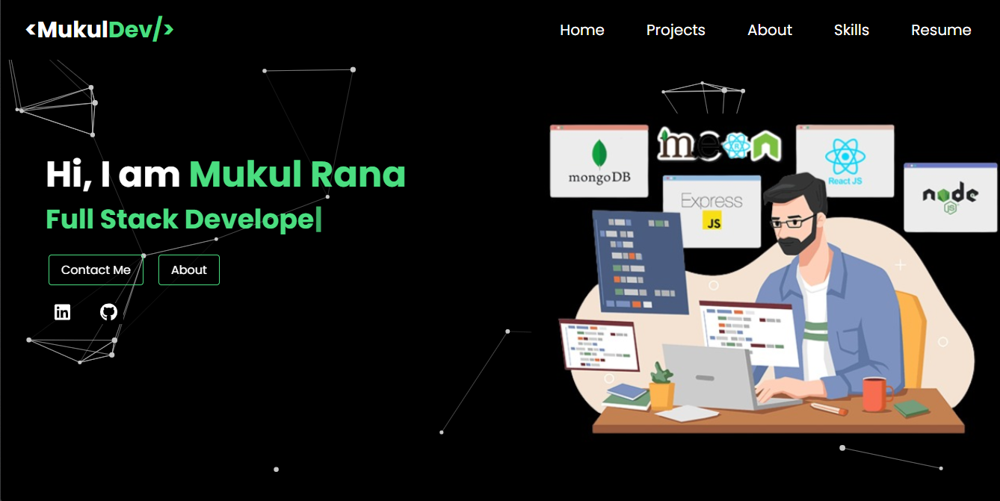

# Personal Portfolio Website



## Overview

Welcome to the GitHub repository for my personal portfolio website! This website serves as a showcase of my skills, projects, and passion for web development.

### Technologies Used

- **React**: The website is built using React to ensure a dynamic and responsive user experience.
- **Tailwind CSS**: Tailwind CSS is used for styling, providing a sleek and modern design.
- **Netlify**: The website is hosted on Netlify, ensuring it's fast, reliable, and always accessible.

## Features

- **Dynamic Content**: The website dynamically loads and presents content for easy navigation.
- **Responsive Design**: It's designed to look great on various screen sizes, from desktop to mobile.
- **Portfolio Showcase**: Highlights my projects and provides details about each one.
- **Contact Form**: Allows visitors to get in touch with me easily.
- **Open Source**: This project is open source, so feel free to use it as a template for your own portfolio!

## Usage

1. **Clone the Repository:**

   ```shell
   git clone https://github.com/mukulpythondev/mukul-personal-portfolio.git 
   npm install
   npm start

## Contribution
If you'd like to contribute to this project or suggest improvements, please 
feel free to submit a pull request or open an issue.
